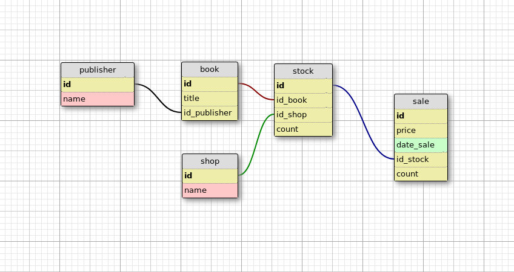

# Домашнее задание к лекции «Python и БД. ORM»

## Задание 1

Составить модели классов SQLAlchemy по схеме:



Интуитивно необходимо выбрать подходящие типы и связи полей.

## Задание 2

Используя SQLAlchemy, составить запрос выборки магазинов, продающих целевого издателя.

Напишите Python скрипт, который:

- Подключается к БД любого типа на ваш выбор (например, к PostgreSQL).
- Импортирует необходимые модели данных.
- Выводит издателя (publisher), имя или идентификатор которого принимается через `input()`.

## Задание 3 (необязательное)

Заполните БД тестовыми данными.

Тестовые данные берутся из папки `fixtures`. Пример содержания в JSON файле.

Возможная реализация: прочитать json-файл, создать соотведствующие экземляры моделей и сохранить в БД.

<details>

<summary>Пример реализации, но сначала попытайтесь самостоятельно ;)</summary>

```python
import json

import sqlalchemy
from sqlalchemy.orm import sessionmaker

from models import create_tables, Publisher, Shop, Book, Stock, Sale


DSN = '...'
engine = sqlalchemy.create_engine(DSN)
create_tables(engine)

Session = sessionmaker(bind=engine)
session = Session()

with open('fixtures/tests_data.json', 'r') as fd:
    data = json.load(fd)

for record in data:
    model = {
        'publisher': Publisher,
        'shop': Shop,
        'book': Book,
        'stock': Stock,
        'sale': Sale,
    }[record.get('model')]
    session.add(model(id=record.get('pk'), **record.get('fields')))
session.commit()
```

</details>

## Общие советы:

- Параметры подключения к БД следует выносить в отдельные переменные (логин, пароль, название БД и пр.)
- Загружать значения лучше из окружения ОС, например через `os.getenv()`
- Заполнять данными можно вручную или выполнить необязательное задание 3
